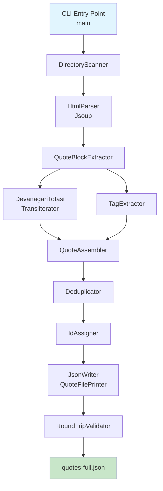

# Design Document: Blog Quote Extractor

## Overview

The Blog Quote Extractor is a standalone Kotlin/JVM command-line tool that lives as a new Gradle module (`extractor`) within the existing DailySanskritQuotes project. It reads a directory of exported Blogger HTML files from `subhashitani-en.blogspot.com`, extracts structured Sanskrit quote data from each post, generates uniform IAST transliteration from Devanagari text, deduplicates quotes, and outputs a `quotes-full.json` file conforming to the app's `QuoteFile` schema.

The tool reuses the existing `QuoteDto` and `QuoteFile` data models from the `app` module (via a shared module or direct dependency) and leverages the existing `QuoteFileParser`/`QuoteFilePrinter` for round-trip validation.

### Key Design Decisions

1. **New Gradle module**: The extractor is a separate `:extractor` module with a JVM-only target (no Android dependency), keeping it decoupled from the app while sharing data models.
2. **Jsoup for HTML parsing**: Jsoup is the standard JVM library for parsing real-world HTML. It handles malformed markup, encoding issues, and provides a CSS-selector API.
3. **Custom Devanagari-to-IAST mapper**: A lookup-table-based transliterator converts Devanagari Unicode codepoints to IAST characters. This is straightforward for Sanskrit (finite character set) and avoids external library dependencies.
4. **kotlinx.serialization for JSON**: Consistent with the existing app, ensuring format compatibility.
5. **Deterministic ordering**: Files are processed in alphabetical order by path, making ID assignment reproducible across runs.

## Architecture



### Processing Pipeline

1. **DirectoryScanner** — Recursively finds all `.html` files in the input directory, sorted alphabetically.
2. **HtmlParser** — Parses each HTML file with Jsoup, extracts the post body content and metadata (labels).
3. **QuoteBlockExtractor** — Identifies the quote structure within the post body: Devanagari verse, attribution, HK transliteration (skipped), English translation, English attribution, and labels.
4. **DevanagariToIast** — Converts the Devanagari `sanskritText` to IAST transliteration using a character-mapping table.
5. **TagExtractor** — Extracts tags from Blogger labels (filtering out "Subhashita" and attribution-duplicate labels), or generates thematic tags from the English translation when labels are absent.
6. **QuoteAssembler** — Builds `QuoteDto` instances from extracted fields.
7. **Deduplicator** — Removes duplicate quotes by normalized `sanskritText`, merging tags across occurrences.
8. **IdAssigner** — Assigns sequential zero-padded IDs (`q0001`, `q0002`, …) to deduplicated quotes.
9. **JsonWriter** — Serializes the `QuoteFile` using `kotlinx.serialization` with pretty-printing, omitting empty `transliteration` and `tags` fields.
10. **RoundTripValidator** — Parses the generated JSON back with `QuoteFileParser` and compares to the in-memory model to verify format correctness.

## Components and Interfaces

### CLI Entry Point

```kotlin
// extractor/src/main/kotlin/com/dailysanskritquotes/extractor/Main.kt
fun main(args: Array<String>)
```

Parses two required arguments: `--input <dir>` and `--output <file>`. Validates the input directory exists and contains `.html` files. Orchestrates the pipeline and prints the processing summary.

### DirectoryScanner

```kotlin
object DirectoryScanner {
    fun findHtmlFiles(inputDir: Path): List<Path>
}
```

Returns all `.html` files under `inputDir` recursively, sorted by path. Returns an empty list if none found (caller handles the error).

### HtmlParser

```kotlin
data class ParsedPost(
    val title: String,           // Post title text
    val bodyElements: List<String>, // Text segments from the post body
    val labels: List<String>     // Blogger labels (may be empty)
)

object HtmlParser {
    fun parse(file: Path): ParsedPost?
}
```

Uses Jsoup to parse the HTML file. Extracts the post title, the ordered text segments from the post body `<div>`, and the labels from the "Labels:" metadata section. Returns `null` if the file cannot be parsed (logs a warning).

### QuoteBlockExtractor

```kotlin
data class RawQuote(
    val sanskritText: String,
    val attribution: String,
    val englishTranslation: String,
    val labels: List<String>,
    val sourceFile: String
)

object QuoteBlockExtractor {
    fun extract(post: ParsedPost, sourceFile: String): RawQuote?
}
```

Identifies the Devanagari verse (Unicode range U+0900–U+097F), skips the HK transliteration block, extracts the English translation, and resolves the attribution from the Devanagari or English attribution line. Returns `null` if the post doesn't match the expected structure.

### DevanagariToIast

```kotlin
object DevanagariToIast {
    fun transliterate(devanagari: String): String
}
```

Maps each Devanagari character to its IAST equivalent using a lookup table. Handles:
- Vowels (independent and dependent/matra forms)
- Consonants with implicit 'a' (added unless followed by a virama ्, another matra, or end of word)
- Virama (halant) — suppresses implicit 'a'
- Anusvara (ं → ṃ), Visarga (ः → ḥ), Chandrabindu (ँ → m̐)
- Danda (। → |), Double Danda (॥ → ||)
- Devanagari numerals (०-९ → 0-9)
- Non-Devanagari characters passed through unchanged

### TagExtractor

```kotlin
object TagExtractor {
    fun fromLabels(labels: List<String>, attribution: String): List<String>
    fun fromTranslation(englishTranslation: String): List<String>
    fun extract(labels: List<String>, attribution: String, englishTranslation: String): List<String>
}
```

- `fromLabels`: Filters out "Subhashita" (case-insensitive) and labels matching the attribution, returns up to 2 remaining labels.
- `fromTranslation`: Keyword-based thematic classification. Maps keywords in the English translation to categories like "Wisdom", "Virtue", "Education", "Devotion", "Duty", "Friendship", "Knowledge", etc. Returns up to 2 most relevant tags.
- `extract`: Uses `fromLabels` first; falls back to `fromTranslation` if no labels remain after filtering.

### Deduplicator

```kotlin
data class DeduplicationResult(
    val uniqueQuotes: List<RawQuote>,
    val duplicateCount: Int,
    val duplicateLog: List<String>  // Log messages for each duplicate found
)

object Deduplicator {
    fun deduplicate(quotes: List<RawQuote>): DeduplicationResult
    fun normalize(text: String): String  // trim + collapse whitespace
}
```

Groups quotes by `normalize(sanskritText)`. Keeps the first occurrence, merges tags from all occurrences (deduplicated), and logs duplicates.

### IdAssigner

```kotlin
object IdAssigner {
    fun assignIds(quotes: List<RawQuote>): List<QuoteDto>
}
```

Assigns IDs in format `q0001`, `q0002`, etc. Determines padding width from total count (4 digits for ≤9999, wider if needed). Builds `QuoteDto` instances with IAST transliteration generated via `DevanagariToIast`.

### JsonWriter

```kotlin
object JsonWriter {
    fun write(quotes: List<QuoteDto>, outputPath: Path)
}
```

Creates a `QuoteFile(version = 1, quotes = quotes)`, serializes with `kotlinx.serialization` (pretty-print, 4-space indent), and writes to the output path. Uses `@EncodeDefault` strategy or a custom serializer to omit empty `transliteration` and `tags` fields.

### RoundTripValidator

```kotlin
object RoundTripValidator {
    fun validate(jsonString: String): Result<Unit>
}
```

Parses the JSON string with `QuoteFileParser.parseQuoteFile()`, then re-prints with `QuoteFilePrinter.print()`, and compares the two parsed `QuoteFile` objects for semantic equality. Returns `Result.failure` with a descriptive message if validation fails.

## Data Models

The extractor reuses the existing app data models:

### QuoteDto (existing)

```kotlin
@Serializable
data class QuoteDto(
    val id: String,
    val sanskritText: String,
    val englishTranslation: String,
    val attribution: String,
    val transliteration: String = "",
    val tags: List<String> = emptyList()
)
```

### QuoteFile (existing)

```kotlin
@Serializable
data class QuoteFile(
    val version: Int,
    val quotes: List<QuoteDto>
)
```

### RawQuote (new, internal to extractor)

```kotlin
data class RawQuote(
    val sanskritText: String,
    val attribution: String,
    val englishTranslation: String,
    val labels: List<String>,
    val sourceFile: String
)
```

Intermediate representation before ID assignment and transliteration. The `sourceFile` field is retained for duplicate logging.

### ParsedPost (new, internal to extractor)

```kotlin
data class ParsedPost(
    val title: String,
    val bodyElements: List<String>,
    val labels: List<String>
)
```

### JSON Output Format

The output follows the existing `quotes-full.json` convention. Fields with default values (`transliteration = ""`, `tags = []`) are omitted from the JSON:

```json
{
    "version": 1,
    "quotes": [
        {
            "id": "q0001",
            "sanskritText": "धर्मो रक्षति रक्षितः",
            "englishTranslation": "Dharma protects those who protect it.",
            "attribution": "Manusmriti",
            "transliteration": "dharmo rakṣati rakṣitaḥ",
            "tags": ["Duty", "Wisdom"]
        },
        {
            "id": "q0002",
            "sanskritText": "सत्यमेव जयते",
            "englishTranslation": "Truth alone triumphs.",
            "attribution": "Mundaka Upanishad",
            "transliteration": "satyameva jayate"
        }
    ]
}
```


## Correctness Properties

*A property is a characteristic or behavior that should hold true across all valid executions of a system — essentially, a formal statement about what the system should do. Properties serve as the bridge between human-readable specifications and machine-verifiable correctness guarantees.*

### Property 1: Recursive HTML file discovery

*For any* directory tree containing a mix of `.html` and non-`.html` files at arbitrary nesting depths, the DirectoryScanner should return exactly the set of files with `.html` extensions, and no others.

**Validates: Requirements 1.5**

### Property 2: Quote field extraction completeness

*For any* well-formed blog post HTML containing a Devanagari verse block followed by a transliteration block and an English translation block, the QuoteBlockExtractor should produce a RawQuote whose `sanskritText` contains the original Devanagari text and whose `englishTranslation` contains the original English text.

**Validates: Requirements 2.2, 3.1, 3.2, 4.1**

### Property 3: Attribution extraction from title

*For any* post title in the format `{Source} - {Topic}` where Source and Topic are non-empty strings, the extractor should parse the Source portion as the attribution value. *For any* quote block with an English attribution line prefixed with `- `, the attribution field should equal the text after the prefix.

**Validates: Requirements 2.3, 3.3, 4.2**

### Property 4: Devanagari-to-IAST transliteration produces valid IAST

*For any* string composed of Devanagari characters (U+0900–U+097F), the `DevanagariToIast.transliterate` function should produce a string containing only valid IAST Latin characters (including diacritics: ā, ī, ū, ṛ, ṝ, ḷ, ḹ, ṃ, ḥ, ñ, ṅ, ṇ, ṭ, ḍ, ś, ṣ), ASCII punctuation (|, ||), digits (0-9), and whitespace.

**Validates: Requirements 3.5**

### Property 5: Tag filtering invariants

*For any* list of Blogger labels and an attribution string, the `TagExtractor.fromLabels` function should return a list that (a) does not contain "Subhashita" (case-insensitive), (b) does not contain any label matching the attribution, and (c) has at most 2 elements.

**Validates: Requirements 3.8, 4.3, 4.4, 4.5, 4.7**

### Property 6: Fallback tag generation

*For any* quote where the labels list is empty or all labels are excluded by filtering, the `TagExtractor.extract` function should return tags derived from the English translation text (not from labels), with at most 2 tags.

**Validates: Requirements 4.6**

### Property 7: ID format and sequential assignment

*For any* positive integer N representing the number of quotes, the IdAssigner should produce IDs `q0001` through `q{N}` (zero-padded to at least 4 digits), where each ID is unique and the sequence is contiguous with no gaps.

**Validates: Requirements 5.1, 5.3**

### Property 8: Deduplication keeps first occurrence

*For any* list of RawQuotes where some share the same normalized `sanskritText`, the Deduplicator should return a list where (a) each normalized `sanskritText` appears exactly once, (b) the retained quote is the first occurrence from the input list, and (c) the output length equals the number of distinct normalized texts.

**Validates: Requirements 6.1, 6.3**

### Property 9: Text normalization is idempotent

*For any* string, applying `Deduplicator.normalize` twice should produce the same result as applying it once: `normalize(normalize(x)) == normalize(x)`.

**Validates: Requirements 6.2**

### Property 10: Tag merging across duplicates

*For any* list of RawQuotes containing duplicates with different tags, the Deduplicator should produce a merged quote whose tags list is the deduplicated union of all tags from all occurrences, with at most 2 tags retained.

**Validates: Requirements 6.5**

### Property 11: Empty field omission in JSON serialization

*For any* QuoteDto where `transliteration` is an empty string, the serialized JSON should not contain a `"transliteration"` key. *For any* QuoteDto where `tags` is an empty list, the serialized JSON should not contain a `"tags"` key.

**Validates: Requirements 7.4, 7.5**

### Property 12: QuoteFile round-trip

*For any* valid `QuoteFile` produced by the extractor, parsing the JSON with `QuoteFileParser.parseQuoteFile` and then printing with `QuoteFilePrinter.print` should produce a `QuoteFile` that is semantically equivalent to the original (all quote fields match).

**Validates: Requirements 7.1, 7.2, 8.1**

## Error Handling

| Scenario | Behavior | Exit Code |
|---|---|---|
| Input directory does not exist | Print error message to stderr, exit | Non-zero |
| Input directory contains no `.html` files | Print error message to stderr, exit | Non-zero |
| Individual HTML file cannot be parsed (malformed/encoding) | Log warning with filename, skip file, continue | N/A (continues) |
| Quote block not detected in a valid HTML file | Log warning with filename, skip file, continue | N/A (continues) |
| Generated JSON fails schema validation (round-trip check) | Print validation error to stderr, exit | Non-zero |
| Output file path is not writable | Print error message to stderr, exit | Non-zero |
| Successful processing | Print summary to stdout, exit | 0 |

All warnings and errors are written to stderr. The processing summary is written to stdout. The tool uses Kotlin's `Result` type for error propagation within the pipeline, with top-level `main` handling the final exit code.

## Testing Strategy

### Unit Tests

Unit tests cover specific examples, edge cases, and error conditions:

- **HtmlParser**: Parse a sample Blogger HTML file and verify extracted title, body elements, and labels
- **QuoteBlockExtractor**: Extract from a known blog post structure and verify all fields
- **DevanagariToIast**: Test specific known transliterations (e.g., "धर्मो" → "dharmo", "रक्षति" → "rakṣati")
- **DevanagariToIast edge cases**: Danda/double-danda handling, Devanagari numerals, virama at end of word, chandrabindu
- **TagExtractor**: Test label filtering with known inputs, fallback generation with known translations
- **Deduplicator**: Test with known duplicate sets, verify first-occurrence retention
- **IdAssigner**: Test ID format for counts ≤ 9999 and > 9999
- **CLI error handling**: Missing directory, empty directory, validation failure
- **Attribution defaults**: Missing attribution → "Unknown"

### Property-Based Tests

Property-based tests use **Kotest Property** (already a project dependency) to verify universal properties across randomly generated inputs. Each property test runs a minimum of 100 iterations.

Each test is tagged with a comment referencing the design property:

```
// Feature: blog-quote-extractor, Property {N}: {property title}
```

Property tests to implement:

1. **Feature: blog-quote-extractor, Property 1: Recursive HTML file discovery** — Generate random directory trees with mixed file extensions, verify only `.html` files returned
2. **Feature: blog-quote-extractor, Property 2: Quote field extraction completeness** — Generate random Devanagari text and English translations, embed in HTML structure, verify extraction
3. **Feature: blog-quote-extractor, Property 3: Attribution extraction from title** — Generate random `{Source} - {Topic}` titles, verify source extraction
4. **Feature: blog-quote-extractor, Property 4: Devanagari-to-IAST transliteration produces valid IAST** — Generate random Devanagari strings, verify output contains only valid IAST characters
5. **Feature: blog-quote-extractor, Property 5: Tag filtering invariants** — Generate random label lists and attributions, verify filtering rules
6. **Feature: blog-quote-extractor, Property 6: Fallback tag generation** — Generate quotes with empty/fully-excluded labels, verify tags come from translation
7. **Feature: blog-quote-extractor, Property 7: ID format and sequential assignment** — Generate random quote counts, verify ID format and contiguity
8. **Feature: blog-quote-extractor, Property 8: Deduplication keeps first occurrence** — Generate random quote lists with duplicates, verify first-occurrence retention
9. **Feature: blog-quote-extractor, Property 9: Text normalization is idempotent** — Generate random strings with varied whitespace, verify `normalize(normalize(x)) == normalize(x)`
10. **Feature: blog-quote-extractor, Property 10: Tag merging across duplicates** — Generate duplicate quotes with different tags, verify merged union
11. **Feature: blog-quote-extractor, Property 11: Empty field omission in JSON serialization** — Generate QuoteDtos with empty transliteration/tags, verify JSON omission
12. **Feature: blog-quote-extractor, Property 12: QuoteFile round-trip** — Generate random QuoteFile instances, verify `parse(print(file))` equals original

### Test Configuration

- **Library**: Kotest Property (`io.kotest:kotest-property`)
- **Runner**: JUnit 5 Platform via Kotest runner
- **Minimum iterations**: 100 per property test (configured via `checkAll(100, ...)`)
- **Module**: Tests live in `extractor/src/test/kotlin/`
