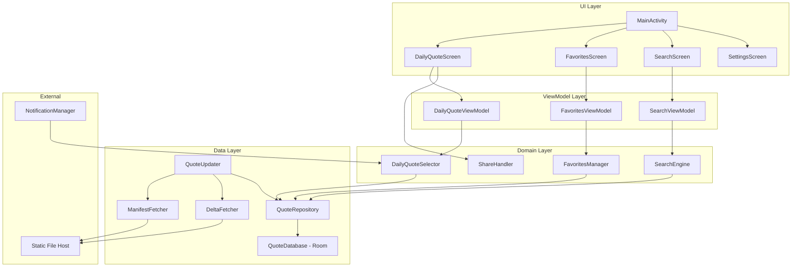
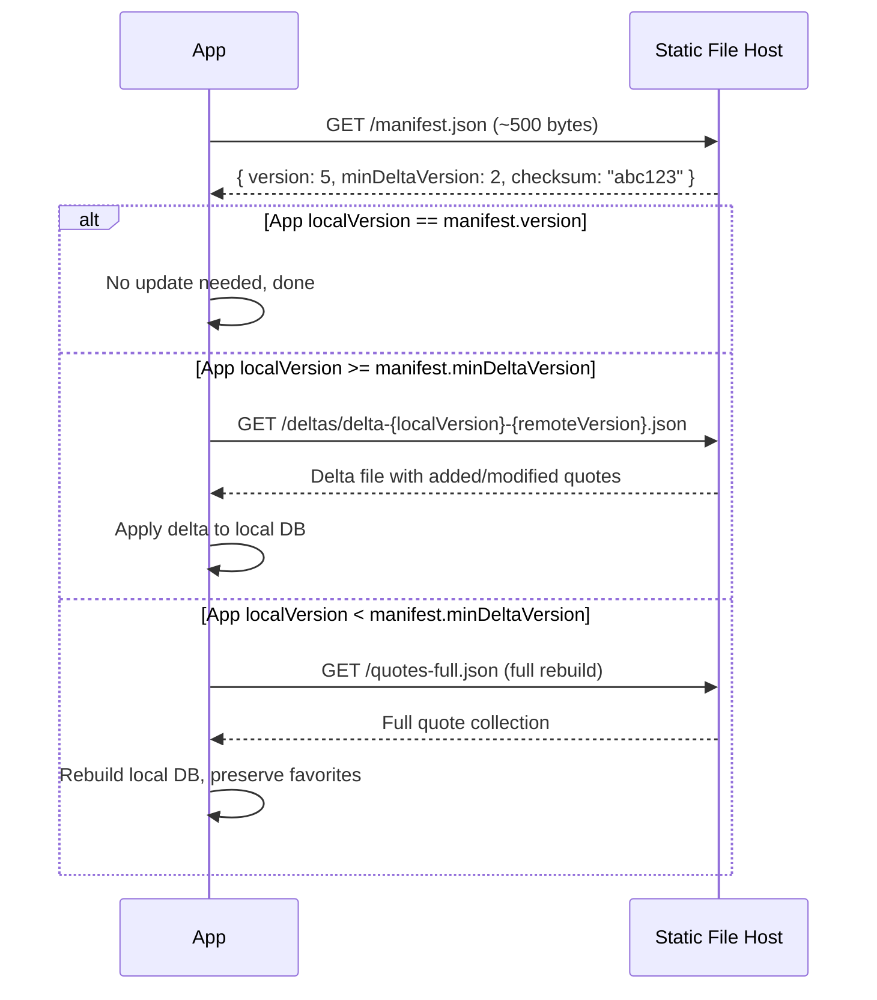

# Design Document: Daily Sanskrit Quotes

## Overview

Daily Sanskrit Quotes is a native Android application (Kotlin, Jetpack Compose) that presents one Sanskrit quote per day with its English translation. The app ships with a bundled quote database and uses an incremental delta-based sync mechanism to fetch only changed or added quotes from a static file host (e.g., GitHub Pages, S3). Users can favorite quotes, share them, search the collection with natural language, and receive daily notifications.

The key architectural decision is the **incremental sync strategy**: instead of downloading the entire quote collection on every update check, the app fetches a lightweight manifest file to detect changes, then downloads only small delta files containing new or modified quotes. This minimizes bandwidth, speeds up updates, and scales well as the collection grows.

## Architecture

The app follows a single-activity MVVM architecture with Jetpack Compose for UI, Room for local persistence, and WorkManager for background sync.



### Technology Stack

| Component | Technology |
|---|---|
| Language | Kotlin |
| UI | Jetpack Compose + Material 3 |
| Local DB | Room (SQLite) |
| Networking | Ktor Client (or OkHttp) |
| Background Work | WorkManager |
| DI | Hilt |
| Notifications | Android NotificationManager + AlarmManager |
| Serialization | kotlinx.serialization |
| Testing | JUnit 5, Kotest (property-based testing) |

## Components and Interfaces

### 1. DailyQuoteSelector

Responsible for deterministically selecting one quote per day.

```kotlin
interface DailyQuoteSelector {
    /** Returns the quote for the given date. Same date always returns same quote. */
    suspend fun getQuoteForDate(date: LocalDate): Quote

    /** Resets the display cycle when all quotes have been shown. */
    suspend fun resetCycleIfNeeded()
}
```

**Algorithm**: Maintains a `shown_quotes` table tracking which quote IDs have been displayed. On each new day, selects a random unshown quote. When all quotes are shown, clears the table and restarts.

### 2. FavoritesManager

```kotlin
interface FavoritesManager {
    suspend fun toggleFavorite(quoteId: String)
    fun getFavorites(): Flow<List<Quote>>  // reverse chronological by favorited_at
    suspend fun isFavorite(quoteId: String): Boolean
}
```

### 3. SearchEngine

```kotlin
interface SearchEngine {
    /** Case-insensitive partial match against Sanskrit text and English translation. */
    suspend fun search(query: String): List<Quote>
}
```

Uses Room's FTS (Full-Text Search) virtual table for sub-500ms results on up to 5000 quotes.

### 4. ShareHandler

```kotlin
interface ShareHandler {
    /** Formats quote and launches Android share sheet. */
    fun share(context: Context, quote: Quote)
}
```

Formats as:
```
"<Sanskrit text>"

"<English translation>"

— <Attribution>

Shared via Daily Sanskrit Quotes
```

### 5. QuoteUpdater (Incremental Delta Sync)

The core component redesigned for efficient incremental updates. Instead of downloading the full quote collection, it uses a manifest + delta approach with static files.

#### Cloud Data Organization

All files are hosted on a static file server (GitHub Pages, S3, etc.) at a base URL:

```
<base_url>/
├── manifest.json          # Lightweight metadata: current version, checksums
├── quotes-full.json       # Full collection (used only for first install fallback)
├── deltas/
│   ├── delta-1-2.json     # Changes from version 1 → 2
│   ├── delta-2-3.json     # Changes from version 2 → 3
│   ├── delta-3-4.json     # Changes from version 3 → 4
│   └── ...
```

**Design rationale**: Delta files are small (typically a few KB) and named by version range. The manifest is under 1 KB. This means a typical update check costs one tiny HTTP request, and applying an update costs one more small request per version gap.

#### Sync Protocol



#### Delta Strategy Details

- **Cumulative deltas**: Each delta file contains ALL changes from version X to version Y (not just one step). For example, `delta-3-5.json` contains everything needed to go from v3 to v5 in one file. This avoids chaining multiple delta downloads.
- **minDeltaVersion**: The manifest declares the oldest version for which a delta is available. If the app's local version is older than this, it falls back to a full download. This lets the server prune old delta files over time.
- **Checksum validation**: The manifest includes a SHA-256 checksum of the full collection. After applying a delta, the app can optionally verify integrity by computing a checksum of its local data.

```kotlin
interface QuoteUpdater {
    /** Checks manifest and applies incremental update if available. */
    suspend fun syncIfNeeded(): SyncResult
}

sealed class SyncResult {
    object AlreadyUpToDate : SyncResult()
    data class DeltaApplied(val fromVersion: Int, val toVersion: Int, val quotesChanged: Int) : SyncResult()
    data class FullRebuild(val version: Int, val totalQuotes: Int) : SyncResult()
    data class Failed(val reason: String) : SyncResult()
}
```

#### Sync Algorithm

1. Check if 24+ hours since last successful sync. If not, skip.
2. Fetch `manifest.json` from the configured base URL.
3. Compare `manifest.version` with local `db_version` stored in SharedPreferences.
4. If versions match → `AlreadyUpToDate`.
5. If `localVersion >= manifest.minDeltaVersion` → fetch `deltas/delta-{localVersion}-{manifest.version}.json`, parse, and apply:
   - Insert new quotes (action: `"add"`)
   - Update modified quotes (action: `"update"`) — preserve favorite status
   - Optionally delete removed quotes (action: `"delete"`) — only if not favorited
6. If `localVersion < manifest.minDeltaVersion` → fetch `quotes-full.json`, rebuild DB, preserve favorites.
7. Update local `db_version` to `manifest.version` and `last_sync_timestamp`.

### 6. NotificationManager

```kotlin
interface QuoteNotificationManager {
    fun scheduleDailyNotification(hour: Int = 8, minute: Int = 0)
    fun cancelAllNotifications()
    fun updateNotificationTime(hour: Int, minute: Int)
}
```

Uses `AlarmManager` with `setExactAndAllowWhileIdle` for reliable daily delivery. A `BroadcastReceiver` handles the alarm and posts the notification.

### 7. QuoteRepository

Central data access layer that coordinates between Room DB and the updater.

```kotlin
interface QuoteRepository {
    suspend fun getQuoteById(id: String): Quote?
    suspend fun getAllQuotes(): List<Quote>
    suspend fun getUnshownQuotes(): List<Quote>
    suspend fun markAsShown(quoteId: String, date: LocalDate)
    suspend fun resetShownQuotes()
    fun searchQuotes(query: String): Flow<List<Quote>>
    suspend fun getLocalVersion(): Int
    suspend fun applyDelta(delta: QuoteDelta)
    suspend fun rebuildFromFull(quotes: List<Quote>)
}
```

## Data Models

### Quote Entity (Room)

```kotlin
@Entity(tableName = "quotes")
data class QuoteEntity(
    @PrimaryKey val id: String,
    val sanskritText: String,
    val englishTranslation: String,
    val attribution: String,
    val isFavorite: Boolean = false,
    val favoritedAt: Long? = null  // epoch millis, null if not favorited
)
```

### Shown Quotes Tracking

```kotlin
@Entity(tableName = "shown_quotes")
data class ShownQuoteEntity(
    @PrimaryKey val quoteId: String,
    val shownDate: String  // ISO date: "2025-01-15"
)
```

### FTS Virtual Table (for search)

```kotlin
@Fts4(contentEntity = QuoteEntity::class)
@Entity(tableName = "quotes_fts")
data class QuoteFtsEntity(
    val sanskritText: String,
    val englishTranslation: String
)
```

### Sync Metadata (SharedPreferences)

```kotlin
data class SyncMetadata(
    val dbVersion: Int,           // current local data version
    val lastSyncTimestamp: Long,  // epoch millis of last successful sync
    val baseUrl: String           // configurable remote URL
)
```

## Quote File Formats

### 1. Manifest File (`manifest.json`)

A lightweight metadata file (~500 bytes) fetched on every update check.

```json
{
  "version": 5,
  "minDeltaVersion": 2,
  "totalQuotes": 5120,
  "checksum": "sha256:a3f2b8c1d4e5...",
  "updatedAt": "2025-07-15T10:30:00Z"
}
```

| Field | Type | Description |
|---|---|---|
| `version` | int | Current version of the quote collection |
| `minDeltaVersion` | int | Oldest version from which a delta file is available |
| `totalQuotes` | int | Total number of quotes in the current version |
| `checksum` | string | SHA-256 hash of the full collection for integrity verification |
| `updatedAt` | string | ISO 8601 timestamp of when this version was published |

### 2. Full Quote File (`quotes-full.json`)

Used for initial bundled data and full-rebuild fallback.

```json
{
  "version": 5,
  "quotes": [
    {
      "id": "q001",
      "sanskritText": "धर्मो रक्षति रक्षितः",
      "englishTranslation": "Dharma protects those who protect it.",
      "attribution": "Manusmriti"
    }
  ]
}
```

### 3. Delta File (`deltas/delta-{from}-{to}.json`)

Contains only the changes between two versions. Cumulative — one file covers the entire gap.

```json
{
  "fromVersion": 3,
  "toVersion": 5,
  "changes": [
    {
      "action": "add",
      "quote": {
        "id": "q5001",
        "sanskritText": "...",
        "englishTranslation": "...",
        "attribution": "..."
      }
    },
    {
      "action": "update",
      "quote": {
        "id": "q042",
        "sanskritText": "...(corrected)...",
        "englishTranslation": "...(corrected)...",
        "attribution": "..."
      }
    },
    {
      "action": "delete",
      "quoteId": "q999"
    }
  ]
}
```

| Action | Fields | Behavior |
|---|---|---|
| `add` | Full `quote` object | Insert new quote into DB |
| `update` | Full `quote` object | Update existing quote, preserve `isFavorite` and `favoritedAt` |
| `delete` | `quoteId` only | Remove quote from DB (skip if favorited, or unfavorite first) |

### Serialization Models (kotlinx.serialization)

```kotlin
@Serializable
data class Manifest(
    val version: Int,
    val minDeltaVersion: Int,
    val totalQuotes: Int,
    val checksum: String,
    val updatedAt: String
)

@Serializable
data class QuoteFile(
    val version: Int,
    val quotes: List<QuoteDto>
)

@Serializable
data class QuoteDto(
    val id: String,
    val sanskritText: String,
    val englishTranslation: String,
    val attribution: String
)

@Serializable
data class QuoteDelta(
    val fromVersion: Int,
    val toVersion: Int,
    val changes: List<DeltaChange>
)

@Serializable
data class DeltaChange(
    val action: String,       // "add", "update", "delete"
    val quote: QuoteDto? = null,  // present for add/update
    val quoteId: String? = null   // present for delete
)
```

### Quote Pretty-Printer

```kotlin
object QuoteFilePrinter {
    fun print(quotes: List<QuoteDto>, version: Int): String {
        val file = QuoteFile(version = version, quotes = quotes)
        return Json { prettyPrint = true }.encodeToString(file)
    }
}
```

### Quote Parser

```kotlin
object QuoteFileParser {
    fun parseQuoteFile(json: String): Result<QuoteFile>
    fun parseManifest(json: String): Result<Manifest>
    fun parseDelta(json: String): Result<QuoteDelta>
}
```

## Correctness Properties

*A property is a characteristic or behavior that should hold true across all valid executions of a system — essentially, a formal statement about what the system should do. Properties serve as the bridge between human-readable specifications and machine-verifiable correctness guarantees.*

### Property 1: Daily quote determinism

*For any* date and any non-empty quote database, calling `getQuoteForDate(date)` multiple times shall always return exactly one quote, and it shall be the same quote each time.

**Validates: Requirements 1.1, 1.3**

### Property 2: Quote uniqueness within a display cycle

*For any* quote database of size N, selecting quotes for N consecutive days shall produce N distinct quote IDs. After all N quotes have been shown, the next selection shall succeed (cycle resets) and produce a valid quote.

**Validates: Requirements 1.4, 1.5**

### Property 3: Quote storage round-trip

*For any* valid Quote entity stored in the database, retrieving it by ID shall return a quote with identical `id`, `sanskritText`, `englishTranslation`, `attribution`, `isFavorite`, and `favoritedAt` fields.

**Validates: Requirements 2.2, 2.3, 3.4**

### Property 4: Favorite toggle is self-inverse

*For any* quote in the database, toggling its favorite status twice shall return the quote to its original favorite state (`isFavorite` and `favoritedAt` unchanged or both reset).

**Validates: Requirements 3.1, 3.2**

### Property 5: Favorites are reverse-chronologically ordered

*For any* set of favorited quotes with distinct `favoritedAt` timestamps, the list returned by `getFavorites()` shall be sorted in strictly descending order of `favoritedAt`.

**Validates: Requirements 3.3**

### Property 6: Share formatting contains all fields

*For any* Quote with non-empty `sanskritText`, `englishTranslation`, and `attribution`, the formatted share string shall contain all three values as substrings.

**Validates: Requirements 4.2**

### Property 7: Search completeness (case-insensitive, partial match)

*For any* quote in the database and any substring of its `englishTranslation` or `sanskritText` (length ≥ 1), searching for that substring (in any letter case) shall return a result set that includes that quote.

**Validates: Requirements 5.1, 5.2**

### Property 8: Sync timing gate

*For any* `lastSyncTimestamp` that is less than 24 hours ago, `syncIfNeeded()` shall return `AlreadyUpToDate` without making any network requests. *For any* `lastSyncTimestamp` that is 24 or more hours ago, `syncIfNeeded()` shall attempt to fetch the manifest.

**Validates: Requirements 6.2**

### Property 9: Delta application correctness

*For any* local quote database at version V and a valid delta file from version V to version W, applying the delta shall result in: (a) all `"add"` quotes existing in the DB, (b) all `"update"` quotes reflecting the new field values, and (c) the local version being updated to W.

**Validates: Requirements 6.3**

### Property 10: Favorites preserved during sync

*For any* set of favorited quotes in the local database and any valid delta or full-rebuild sync operation, the `isFavorite` status and `favoritedAt` timestamp of all previously-favorited quotes shall remain unchanged after the sync completes.

**Validates: Requirements 6.4**

### Property 11: Failed sync preserves local state

*For any* local quote database, if a sync operation fails (network error, invalid manifest, invalid delta, or unparseable data), the local database contents and version number shall remain identical to their pre-sync state.

**Validates: Requirements 6.5, 6.6**

### Property 12: Quote file round-trip (parse ↔ print)

*For any* valid list of `QuoteDto` objects, printing to JSON and then parsing the resulting JSON shall produce an equivalent list of `QuoteDto` objects.

**Validates: Requirements 7.1, 7.2, 7.4, 7.5**

### Property 13: Invalid JSON produces descriptive error

*For any* string that is not valid JSON or does not conform to the Quote_File schema, the parser shall return a failure `Result` containing a non-empty error message (and shall not throw an unhandled exception).

**Validates: Requirements 7.3**

### Property 14: Manifest round-trip (parse ↔ print)

*For any* valid `Manifest` object, serializing to JSON and then deserializing shall produce an equivalent `Manifest` object.

**Validates: Requirements 7.1**

### Property 15: Delta file round-trip (parse ↔ print)

*For any* valid `QuoteDelta` object, serializing to JSON and then deserializing shall produce an equivalent `QuoteDelta` object.

**Validates: Requirements 7.1**

## Error Handling

### Incremental Sync Errors

| Scenario | Behavior |
|---|---|
| Manifest fetch fails (network error, timeout, DNS) | Log warning, return `SyncResult.Failed`. Local DB unchanged. Retry on next app launch after 24h. |
| Manifest JSON is invalid/unparseable | Log error, return `SyncResult.Failed`. Local DB unchanged. |
| Delta file not found (404) | Fall back to full rebuild via `quotes-full.json`. If that also fails, return `SyncResult.Failed`. |
| Delta JSON is invalid/unparseable | Discard delta, return `SyncResult.Failed`. Local DB unchanged. |
| Delta `fromVersion` doesn't match local version | Treat as version mismatch, fall back to full rebuild. |
| Full rebuild file fetch fails | Return `SyncResult.Failed`. Local DB unchanged. |
| Checksum mismatch after delta application | Roll back delta changes (wrap in DB transaction), return `SyncResult.Failed`. |
| Local version < `minDeltaVersion` | Automatically fall back to full rebuild path. |

### Key Error Handling Principles

1. **Transaction safety**: All delta applications and full rebuilds are wrapped in a Room database transaction. If any step fails, the entire operation is rolled back.
2. **Silent failures**: Network and sync errors are never shown to the user (Requirement 6.5). They are logged for developer diagnostics.
3. **Graceful degradation**: The app always works with whatever data is in the local DB, even if it's the original bundled data.

### Other Error Scenarios

| Scenario | Behavior |
|---|---|
| Empty quote database (no bundled data) | Should not happen. If it does, show a placeholder message. |
| Share target unavailable | Display a toast: "Unable to share. Please try again." |
| Search query returns no results | Display "No results found" message in the UI. |
| Notification permission denied (Android 13+) | Prompt user to grant permission. If denied, notifications are silently disabled. |
| Invalid notification time configured | Clamp to valid range (0:00–23:59). |
| Database migration failure | Clear DB and re-import from bundled file. Favorites are lost (last resort). |

## Testing Strategy

### Dual Testing Approach

The app uses both unit tests and property-based tests for comprehensive coverage:

- **Unit tests** (JUnit 5): Verify specific examples, edge cases, integration points, and error conditions.
- **Property-based tests** (Kotest): Verify universal properties across randomly generated inputs with minimum 100 iterations per property.

Together, unit tests catch concrete bugs while property tests verify general correctness across the input space.

### Property-Based Testing Configuration

- **Library**: [Kotest](https://kotest.io/) with the `kotest-property` module
- **Minimum iterations**: 100 per property test
- **Tag format**: Each test is annotated with a comment referencing the design property:
  ```
  // Feature: daily-sanskrit-quotes, Property {number}: {property_text}
  ```
- **Each correctness property is implemented by a single property-based test**

### Test Plan by Component

#### DailyQuoteSelector
- **Property tests**: Properties 1, 2 (determinism, uniqueness, cycle reset)
- **Unit tests**: Edge case — database with exactly 1 quote, date boundary at midnight

#### QuoteRepository / Room DB
- **Property tests**: Property 3 (storage round-trip)
- **Unit tests**: First-launch import from bundled file, FTS index rebuild

#### FavoritesManager
- **Property tests**: Properties 4, 5 (toggle self-inverse, ordering)
- **Unit tests**: Favorite a quote that doesn't exist, concurrent toggle operations

#### ShareHandler
- **Property tests**: Property 6 (format contains all fields)
- **Unit tests**: Quote with special characters, very long text

#### SearchEngine
- **Property tests**: Property 7 (search completeness)
- **Unit tests**: Empty query, query with only whitespace, Unicode/Devanagari search

#### QuoteUpdater (Incremental Sync)
- **Property tests**: Properties 8, 9, 10, 11 (timing gate, delta correctness, favorites preserved, failed sync preserves state)
- **Unit tests**:
  - Manifest indicates no update needed
  - Delta with only adds, only updates, only deletes, mixed
  - Fallback from delta to full rebuild when `localVersion < minDeltaVersion`
  - Checksum verification after delta application
  - Network timeout handling

#### Quote File Parser / Printer
- **Property tests**: Properties 12, 13, 14, 15 (quote file round-trip, invalid JSON error, manifest round-trip, delta round-trip)
- **Unit tests**:
  - Parse the actual bundled `quotes-full.json`
  - Parse a delta file with all three action types
  - Missing required fields in JSON
  - Extra/unknown fields in JSON (should be ignored)

#### NotificationManager
- **Unit tests**: Default 8 AM scheduling, custom time scheduling, cancel all, notification content includes quote text

### Test Infrastructure

- **Room in-memory database** for repository and DB tests
- **MockWebServer** (OkHttp) or similar for simulating static file host responses in sync tests
- **Kotest generators** for random Quote, Manifest, QuoteDelta, and date generation
- **Robolectric** for Android-specific unit tests (notifications, share intents)
