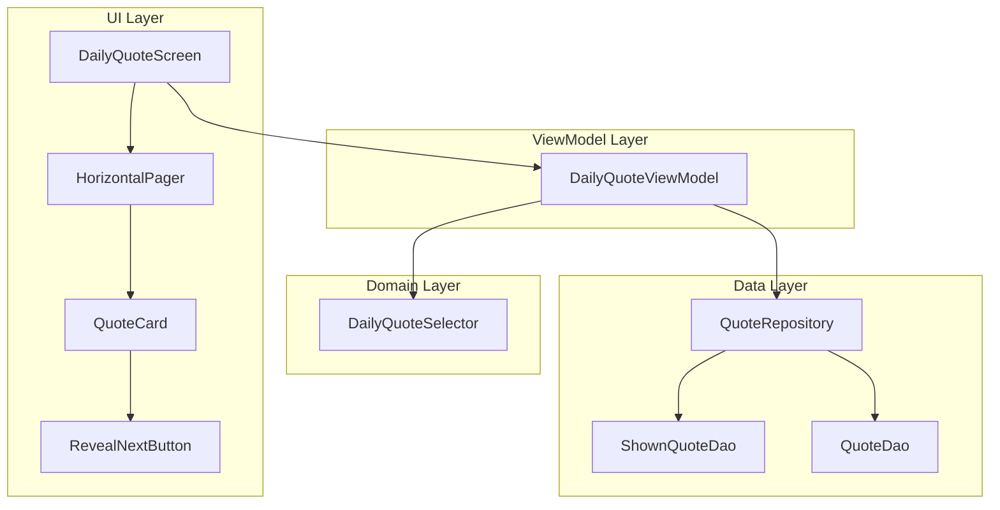
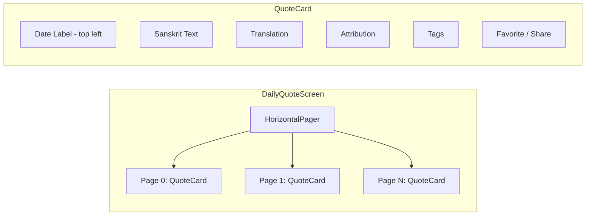

# Design Document: Quote Navigation

## Overview

This design adds three capabilities to the Daily Quote screen:

1. A hidden "Reveal Next Quote" button toggled by triple-tapping the quote card, which selects a new unshown quote on demand (primarily for developer testing).
2. Horizontal swipe navigation between all previously shown quotes using Compose Foundation's `HorizontalPager`.
3. A date label in the top-left corner of the quote card showing when each quote was first revealed, formatted as "dd MMM, yyyy".

These features build on the existing `DailyQuoteSelector`, `ShownQuoteDao`, and `DailyQuoteScreen` without altering the core daily-quote-selection algorithm. The main architectural changes are:
- The DailyQuoteViewModel now manages an ordered list of shown quotes (the "history") and a current page index, rather than a single quote.
- The SearchScreen gains a full-screen pager overlay for swiping through search results.

## Architecture



### Data Flow

1. On screen load, `DailyQuoteViewModel` calls `QuoteRepository` to fetch all `ShownQuoteEntity` records sorted by `shownDate` ascending.
2. For each shown-quote entry, the ViewModel joins the `QuoteEntity` (from `QuoteDao`) with the `shownDate` (from `ShownQuoteDao`) to build a list of `ShownQuoteItem` objects.
3. The ViewModel exposes this list plus a `currentPage` index via a single `StateFlow<DailyQuoteUiState>`.
4. `DailyQuoteScreen` renders a `HorizontalPager` whose pages correspond to the history list. Each page renders a `QuoteCard`.
5. Triple-tapping the card toggles a local `revealButtonVisible` state. Pressing the revealed button calls `viewModel.revealNextQuote()`, which selects a new unshown quote, marks it shown with today's date, appends it to the history, and scrolls the pager to the new page.
6. Each `QuoteCard` displays the formatted `shownDate` in the top-left corner.

### Design Decisions

- **HorizontalPager over manual gesture detection**: Compose Foundation's `HorizontalPager` provides built-in smooth swipe animations, snap-to-page behavior, and accessibility support. It naturally enforces boundary clamping (no swipe past first/last page).
- **Single UI state with history list**: Rather than loading quotes one-at-a-time on swipe, we load the full history upfront. The shown-quotes table is small (one entry per day the app was used), so this is efficient.
- **Triple-tap as a `pointerInput` gesture**: We use `detectTapGestures` with a tap counter + timeout to detect triple-tap, keeping the gesture hidden from normal users.
- **shownDate stored as ISO string, formatted at display time**: The existing `ShownQuoteEntity.shownDate` stores ISO dates (e.g. "2025-01-15"). We parse this to `LocalDate` and format to "dd MMM, yyyy" in the UI layer using `DateTimeFormatter`.

## Components and Interfaces

### New / Modified DAO: `ShownQuoteDao`

Add a query to retrieve all shown quotes ordered by date:

```kotlin
@Query("SELECT * FROM shown_quotes ORDER BY shownDate ASC")
suspend fun getAllShownQuotesSorted(): List<ShownQuoteEntity>
```

### New / Modified Repository: `QuoteRepository`

Add a method to fetch the full shown-quote history with joined quote data:

```kotlin
suspend fun getShownQuoteHistory(): List<Pair<QuoteEntity, String>> // (quote, shownDate)
```

This calls `shownQuoteDao.getAllShownQuotesSorted()`, then for each entry calls `quoteDao.getById(quoteId)` to build the paired list. Entries where the quote no longer exists (deleted via sync) are filtered out.

### New Data Class: `ShownQuoteItem`

```kotlin
data class ShownQuoteItem(
    val quote: QuoteEntity,
    val shownDate: String,       // ISO format from DB, e.g. "2025-01-15"
    val isFavorite: Boolean,
    val customTags: List<CustomTagEntity>
)
```

This is the per-page model used by the UI. It bundles everything needed to render a single quote card page.

### Modified UI State: `DailyQuoteUiState`

```kotlin
sealed class DailyQuoteUiState {
    object Loading : DailyQuoteUiState()
    data class Success(
        val quoteHistory: List<ShownQuoteItem>,
        val currentPageIndex: Int
    ) : DailyQuoteUiState()
    data class Error(val message: String) : DailyQuoteUiState()
}
```

The `Success` state changes from holding a single quote to holding the full history list and the index of the currently displayed page.

### Modified ViewModel: `DailyQuoteViewModel`

Key changes:

- `loadTodayQuote()` → `loadQuoteHistory()`: Fetches all shown quotes, ensures today's quote exists (via `DailyQuoteSelector.getQuoteForDate(today)`), builds the `ShownQuoteItem` list, and sets `currentPageIndex` to the last item (today's quote).
- New `revealNextQuote()`: Calls `DailyQuoteSelector.getQuoteForDate()` with a synthetic mechanism — specifically, it gets unshown quotes from the repository, picks one, marks it shown with today's date, appends to history, and updates the page index.
- New `onPageChanged(index: Int)`: Updates the current page index and reloads favorite/tag state for the newly visible quote.
- `toggleFavorite()` and `shareQuote()` operate on `quoteHistory[currentPageIndex]`.
- `customTags` StateFlow derives from the current page's quote ID.

```kotlin
fun revealNextQuote() {
    viewModelScope.launch {
        // Delegate to selector for a new unshown quote
        val newQuote = dailyQuoteSelector.selectNextUnshownQuote()
        // Reload history to include the new entry
        loadQuoteHistory(scrollToEnd = true)
    }
}

fun onPageChanged(index: Int) {
    val current = _uiState.value as? DailyQuoteUiState.Success ?: return
    _uiState.value = current.copy(currentPageIndex = index)
}
```

### New Domain Method: `DailyQuoteSelector.selectNextUnshownQuote()`

```kotlin
suspend fun selectNextUnshownQuote(): QuoteEntity {
    var candidates = repository.getUnshownQuotes()
    if (candidates.isEmpty()) {
        resetCycleIfNeeded()
        candidates = repository.getAllQuotes()
    }
    val today = LocalDate.now()
    val index = selectQuoteIndex(today.plusDays(candidates.size.toLong()), candidates.size)
    val sorted = candidates.sortedBy { it.id }
    val selected = sorted[index]
    repository.markAsShown(selected.id, today)
    return selected
}
```

This reuses the deterministic selection logic but with a varied seed so it doesn't collide with the day's existing quote.

### Modified UI: `DailyQuoteScreen`

- Wraps the quote card in a `HorizontalPager` with `pageCount = quoteHistory.size`.
- Each page renders a `QuoteCard` composable.
- The `QuoteCard` composable accepts a `ShownQuoteItem` and renders the date in the top-left.
- Triple-tap detection via `Modifier.pointerInput` with a tap counter that resets after 500ms.
- The "Reveal Next Quote" button appears/disappears below the card based on local `revealButtonVisible` state.



### Date Formatting Utility

A simple extension or top-level function in the UI layer:

```kotlin
fun formatShownDate(isoDate: String): String {
    val date = LocalDate.parse(isoDate)
    val formatter = DateTimeFormatter.ofPattern("dd MMM, yyyy", Locale.ENGLISH)
    return date.format(formatter)
}
```

### Modified UI: `SearchScreen` — Search Result Pager

The SearchScreen gains a full-screen pager overlay that opens when a user taps a search result card:

- `SearchViewModel` exposes a new `selectedResultIndex: MutableStateFlow<Int?>` (null = list view, non-null = pager view at that index).
- When `selectedResultIndex` is non-null, the SearchScreen renders a `HorizontalPager` over the search results list, starting at the selected index.
- The pager uses the same `QuoteCard` composable as the DailyQuoteScreen (extracted to a shared composable).
- A back gesture or top-bar back button sets `selectedResultIndex = null` to return to the list.
- Favorite, share, and tag actions work on the currently displayed search result.

```kotlin
// In SearchViewModel
val selectedResultIndex = MutableStateFlow<Int?>(null)

fun selectResult(index: Int) { selectedResultIndex.value = index }
fun clearSelection() { selectedResultIndex.value = null }
```

### Shared `QuoteCardContent` Composable

To avoid duplicating the quote card layout between DailyQuoteScreen and SearchScreen pager, extract the card body into a shared composable:

```kotlin
@Composable
fun QuoteCardContent(
    quote: QuoteEntity,
    shownDate: String?,           // null for search results (no shown date)
    isFavorite: Boolean,
    customTags: List<CustomTagEntity>,
    predefinedTags: List<String>,
    onToggleFavorite: () -> Unit,
    onShare: () -> Unit,
    onAddTag: () -> Unit,
    onRemoveTag: (String) -> Unit
)
```

Both the DailyQuoteScreen pager pages and the SearchScreen pager pages delegate to this composable.

## Data Models

### Existing: `ShownQuoteEntity` (unchanged)

```kotlin
@Entity(tableName = "shown_quotes")
data class ShownQuoteEntity(
    @PrimaryKey val quoteId: String,
    val shownDate: String  // ISO date: "2025-01-15"
)
```

Note: `quoteId` is the primary key, meaning each quote can only appear once in the shown-quotes table. If a quote is "revealed" again after a cycle reset, its `shownDate` is overwritten (REPLACE strategy). This means the history only contains each quote once, with its most recent shown date.

### Existing: `QuoteEntity` (unchanged)

```kotlin
@Entity(tableName = "quotes")
data class QuoteEntity(
    @PrimaryKey val id: String,
    val sanskritText: String,
    val englishTranslation: String,
    val attribution: String,
    val isFavorite: Boolean = false,
    val favoritedAt: Long? = null,
    val transliteration: String = "",
    val tags: String = "[]"
)
```

### New: `ShownQuoteItem` (UI model)

```kotlin
data class ShownQuoteItem(
    val quote: QuoteEntity,
    val shownDate: String,
    val isFavorite: Boolean,
    val customTags: List<CustomTagEntity>
)
```

### Modified: `DailyQuoteUiState`

```kotlin
sealed class DailyQuoteUiState {
    object Loading : DailyQuoteUiState()
    data class Success(
        val quoteHistory: List<ShownQuoteItem>,
        val currentPageIndex: Int
    ) : DailyQuoteUiState()
    data class Error(val message: String) : DailyQuoteUiState()
}
```

The `currentPageIndex` always points to a valid index within `quoteHistory`. On initial load it points to the last element (today's quote). On swipe it updates to the swiped-to page. On reveal it updates to the newly appended last element.


## Correctness Properties

*A property is a characteristic or behavior that should hold true across all valid executions of a system — essentially, a formal statement about what the system should do. Properties serve as the bridge between human-readable specifications and machine-verifiable correctness guarantees.*

### Property 1: Reveal button visibility toggle is an involution

*For any* boolean visibility state, performing the toggle action twice should return the state to its original value, and performing it once should flip the value.

**Validates: Requirements 1.2**

### Property 2: Revealing a quote selects an unshown quote and grows the history

*For any* non-empty set of quotes and any subset of already-shown quotes where at least one unshown quote remains, calling `revealNextQuote` should result in a quote that was previously not in the shown set being added to the shown-quote history, increasing the history length by exactly one.

**Validates: Requirements 1.4, 1.6**

### Property 3: Shown quote history is sorted by shownDate ascending

*For any* set of `ShownQuoteEntity` records returned by the DAO, the `quoteHistory` list in the UI state should be ordered such that for all consecutive pairs `(history[i], history[i+1])`, `history[i].shownDate <= history[i+1].shownDate`.

**Validates: Requirements 2.1**

### Property 4: Page navigation direction correctness

*For any* history of length N and any current page index `i` where `0 <= i < N`, navigating to page `i-1` (when `i > 0`) should display the quote with an earlier or equal shownDate, and navigating to page `i+1` (when `i < N-1`) should display the quote with a later or equal shownDate.

**Validates: Requirements 2.2, 2.3**

### Property 5: Each history page contains correct quote data and shownDate

*For any* `ShownQuoteItem` in the history list, the `quote` field should match the `QuoteEntity` stored in the database for that quote ID, and the `shownDate` field should match the `shownDate` stored in the `shown_quotes` table for that quote ID.

**Validates: Requirements 2.6, 3.3, 3.4**

### Property 6: Date formatting round trip

*For any* valid ISO date string in "yyyy-MM-dd" format, `formatShownDate` should produce a string matching the pattern `dd MMM, yyyy` (e.g. "15 Jan, 2025"), and parsing the formatted string back should yield the original `LocalDate`.

**Validates: Requirements 3.5**

### Property 7: Search pager navigation stays within bounds

*For any* search results list of length N (N >= 1) and any current page index `i` where `0 <= i < N`, the pager index should never go below 0 or above N-1. Navigating left from index 0 should remain at 0, and navigating right from index N-1 should remain at N-1.

**Validates: Requirements 4.5, 4.6**

## Error Handling

| Scenario | Handling |
|---|---|
| No quotes in database at all | `DailyQuoteUiState.Error` with descriptive message. Reveal button does nothing. |
| Quote in shown_quotes table was deleted (sync) | `getShownQuoteHistory()` filters out entries where `quoteDao.getById()` returns null. History may be shorter than the shown_quotes table. |
| All quotes already shown when reveal is pressed | `DailyQuoteSelector.selectNextUnshownQuote()` resets the cycle via `resetCycleIfNeeded()` and selects from the full pool (Requirement 1.5). |
| Invalid/corrupt shownDate string in DB | `formatShownDate` catches `DateTimeParseException` and falls back to displaying the raw ISO string. |
| Empty history (fresh install, no quotes shown yet) | `loadQuoteHistory()` calls `getQuoteForDate(today)` first to ensure at least today's quote is shown, so history is never empty after load. |
| Search results change while pager is open | If the search query changes (e.g. debounce fires), the pager closes (`selectedResultIndex = null`) and the list updates. |

## Testing Strategy

### Unit Tests

Unit tests cover specific examples, edge cases, and integration points:

- **Reveal button default state**: Verify the button is hidden on initial render.
- **Triple-tap toggle**: Verify triple-tap shows the button, another triple-tap hides it.
- **Reveal with no unshown quotes**: Verify cycle reset occurs and a quote is still returned (Requirement 1.5).
- **Boundary swipe clamping**: Verify swiping right on the first page and left on the last page does not change the page index (Requirements 2.4, 2.5).
- **Date formatting specific examples**: Verify "2025-01-15" → "15 Jan, 2025", "2024-12-01" → "01 Dec, 2024".
- **Empty history edge case**: Verify that on fresh load with no shown quotes, today's quote is selected and history has exactly one entry.
- **Deleted quote filtering**: Verify that if a shown_quotes entry references a deleted quote, it is excluded from the history.

### Property-Based Tests

Property-based tests use **Kotest** (already in the project dependencies: `io.kotest:kotest-property:5.8.0`) with a minimum of **100 iterations** per property.

Each property test must be tagged with a comment referencing the design property:

```
// Feature: quote-navigation, Property {N}: {title}
```

| Property | Test Description | Generator Strategy |
|---|---|---|
| Property 1: Toggle involution | Generate random boolean states, apply toggle twice, assert original state restored | `Arb.boolean()` |
| Property 2: Reveal grows history | Generate random lists of quote IDs (total pool) and random subsets (already shown), call reveal logic, assert history grows by 1 and new entry was not previously shown | `Arb.list(Arb.string())` for IDs, random subset selection |
| Property 3: History sorted | Generate random lists of `ShownQuoteEntity` with random ISO dates, sort them, assert ascending order | `Arb.localDate()` for dates, `Arb.string()` for IDs |
| Property 4: Navigation direction | Generate random history lengths (1..100) and random page indices, assert navigation to i±1 yields correct relative date ordering | `Arb.int(1..100)` for length, `Arb.int()` for index |
| Property 5: Data consistency | Generate random `QuoteEntity` + `ShownQuoteEntity` pairs, build `ShownQuoteItem`, assert fields match source data | Custom `Arb` for `QuoteEntity` |
| Property 6: Date format round trip | Generate random `LocalDate` values, format with `formatShownDate`, parse back, assert equality | `Arb.localDate()` |

### Test Configuration

- All property tests run with `PropTestConfig(iterations = 100)` minimum.
- Tests use JUnit 5 platform (already configured in `build.gradle.kts`).
- Kotest property module provides `Arb` generators and `checkAll` / `forAll` functions.
- Room in-memory database (`room-testing`) for integration tests that need actual DAO queries.
- `kotlinx-coroutines-test` for testing suspend functions in the ViewModel and Repository.
