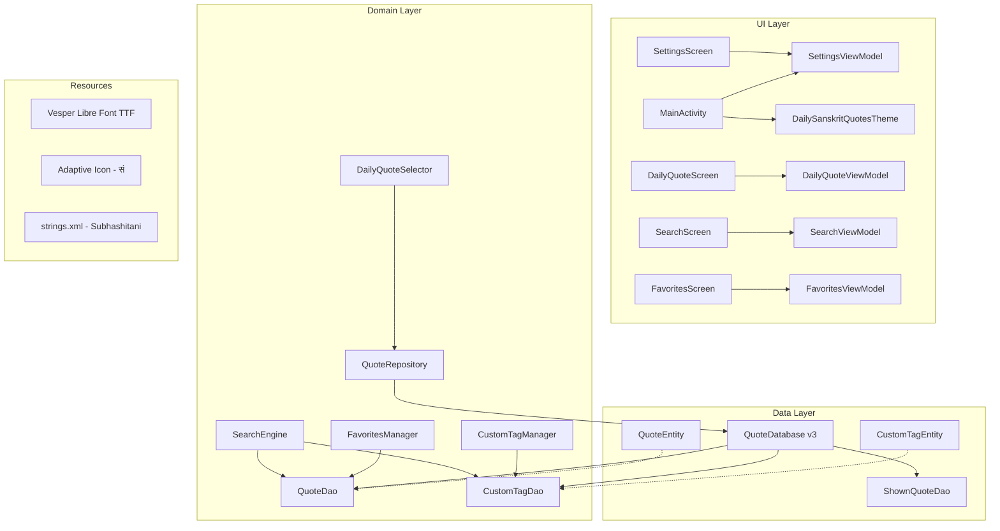

# Design Document: Subhashitani Enhancements

## Overview

This design covers a set of enhancements to the existing Daily Sanskrit Quotes Android app. The changes span renaming, theming fixes, new data fields (transliteration, tags), user custom tags, tag-based search, a new app icon, the Vesper Libre custom font, and a Room database migration to support the new schema.

The app is built with Jetpack Compose, Room, Hilt, and Kotlin Serialization. The existing architecture follows a clean layered pattern: `data` (Room entities, DAOs, DTOs, repository) → `domain` (selectors, managers, search) → `ui` (ViewModels, Compose screens). This design preserves that structure and extends it minimally.

### Key Design Decisions

1. **Tags stored as serialized JSON string in QuoteEntity** — Predefined tags are stored as a comma-separated or JSON-serialized string column on the `quotes` table. This avoids a join table for read-heavy, write-rare predefined tags.
2. **Custom tags use a dedicated `custom_tags` table** — A separate table with `(tagName, quoteId)` composite key supports the many-to-many relationship and allows efficient querying, reuse suggestions, and independent lifecycle from predefined tags.
3. **Vesper Libre font bundled as TTF in `res/font/`** — Using Android's resource font system for reliable loading with a composable `FontFamily`.
4. **Database migration (version 2 → 3)** — An explicit `Migration(2, 3)` adds `transliteration` and `tags` columns to `quotes` and creates the `custom_tags` table, preserving all existing data.
5. **Search extended via LIKE queries on tags** — The existing `searchQuotes` LIKE-based approach is extended to also match against the `tags` column and joined custom tags, keeping the implementation simple and consistent.

## Architecture



The architecture remains unchanged in structure. New additions:
- `CustomTagEntity` + `CustomTagDao` in the data layer
- `CustomTagManager` in the domain layer
- Extended `SearchEngine` to query custom tags
- Updated `Theme.kt` with Vesper Libre `FontFamily` and text size–scaled typography

## Components and Interfaces

### 1. App Rename (Requirement 1)

Change `strings.xml`:
```xml
<string name="app_name">Subhashitani</string>
```

No code changes beyond the string resource. The `AndroidManifest.xml` already references `@string/app_name`.

### 2. Theme System Updates (Requirements 2, 3, 4, 10)

**File: `Theme.kt`**

The existing `DailySanskritQuotesTheme` composable already accepts `darkTheme`, `colorTheme`, and `textSizeOption` parameters, and `MainActivity` already passes them from `SettingsViewModel` state. The settings are already persisted via `SharedPreferences`. The theme composable currently applies color schemes correctly but does not apply a custom typography with Vesper Libre or text size scaling.

Changes:
- Define a `VesperLibre` `FontFamily` loading from `res/font/vesper_libre_regular.ttf` (and bold variant if available).
- Build a scaled `Typography` object that applies `VesperLibre` to `headlineMedium` (Sanskrit text) and `bodyLarge` (transliteration), with font sizes multiplied by `textSizeOption.scale`.
- Pass the constructed `Typography` to `MaterialTheme(typography = ...)`.

```kotlin
val VesperLibre = FontFamily(
    Font(R.font.vesper_libre_regular, FontWeight.Normal),
    Font(R.font.vesper_libre_bold, FontWeight.Bold)
)

fun scaledTypography(scale: Float): Typography {
    val base = Typography()
    return Typography(
        headlineMedium = base.headlineMedium.copy(
            fontFamily = VesperLibre,
            fontSize = base.headlineMedium.fontSize * scale
        ),
        bodyLarge = base.bodyLarge.copy(
            fontFamily = VesperLibre,
            fontSize = base.bodyLarge.fontSize * scale
        ),
        // other styles remain default
    )
}
```

The dark mode toggle, color theme selector, and text size slider in `SettingsScreen` already update `SettingsViewModel` state, which flows to `MainActivity` → `DailySanskritQuotesTheme`. No ViewModel changes needed for requirements 2–4.

### 3. CustomTagDao (Requirement 7)

New Room DAO for the `custom_tags` table:

```kotlin
@Dao
interface CustomTagDao {
    @Insert(onConflict = OnConflictStrategy.IGNORE)
    suspend fun insert(tag: CustomTagEntity)

    @Query("DELETE FROM custom_tags WHERE tagName = :tagName AND quoteId = :quoteId")
    suspend fun delete(tagName: String, quoteId: String)

    @Query("SELECT * FROM custom_tags WHERE quoteId = :quoteId")
    fun getTagsForQuote(quoteId: String): Flow<List<CustomTagEntity>>

    @Query("SELECT DISTINCT tagName FROM custom_tags ORDER BY tagName")
    fun getAllDistinctTagNames(): Flow<List<String>>

    @Query("SELECT DISTINCT quoteId FROM custom_tags WHERE tagName LIKE '%' || :query || '%'")
    suspend fun searchQuoteIdsByTag(query: String): List<String>
}
```

### 4. CustomTagManager (Requirement 7)

New domain class encapsulating custom tag business logic:

```kotlin
class CustomTagManager(private val customTagDao: CustomTagDao) {

    fun getTagsForQuote(quoteId: String): Flow<List<CustomTagEntity>> =
        customTagDao.getTagsForQuote(quoteId)

    fun getAllTagNames(): Flow<List<String>> =
        customTagDao.getAllDistinctTagNames()

    suspend fun addTag(quoteId: String, tagName: String): Boolean {
        val trimmed = tagName.trim()
        if (trimmed.isBlank() || trimmed.length > 30) return false
        customTagDao.insert(CustomTagEntity(tagName = trimmed, quoteId = quoteId))
        return true
    }

    suspend fun removeTag(quoteId: String, tagName: String) {
        customTagDao.delete(tagName, quoteId)
    }
}
```

Validation rules:
- Reject blank/whitespace-only names → return `false`
- Enforce 30-character limit → return `false`
- `OnConflictStrategy.IGNORE` prevents duplicate (tagName, quoteId) pairs

### 5. SearchEngine Updates (Requirement 8)

The existing `SearchEngine` delegates to `QuoteDao.searchQuotes()` which uses a LIKE query on `sanskritText` and `englishTranslation`. To support tag search:

**Option chosen**: Extend the `QuoteDao.searchQuotes` query to also LIKE-match against the `tags` column (predefined tags), and add a secondary query path through `CustomTagDao` for custom tag matches, merging results in `SearchEngine`.

Updated `SearchEngine`:

```kotlin
class SearchEngine(
    private val quoteDao: QuoteDao,
    private val customTagDao: CustomTagDao
) {
    fun search(query: String): Flow<List<QuoteEntity>> {
        // quoteDao.searchQuotes now also matches against `tags` column
        val textResults = quoteDao.searchQuotes(query)
        // Merge with custom tag matches
        return combine(textResults, flow {
            emit(customTagDao.searchQuoteIdsByTag(query))
        }) { textList, customTagQuoteIds ->
            val byId = textList.associateBy { it.id }
            val missing = customTagQuoteIds.filter { it !in byId }
            val extras = missing.mapNotNull { quoteDao.getById(it) }
            textList + extras
        }
    }
}
```

Updated `QuoteDao.searchQuotes`:
```kotlin
@Query("""
    SELECT * FROM quotes 
    WHERE englishTranslation LIKE '%' || :query || '%' 
       OR sanskritText LIKE '%' || :query || '%'
       OR tags LIKE '%' || :query || '%'
""")
fun searchQuotes(query: String): Flow<List<QuoteEntity>>
```

### 6. UI Components (Requirements 5, 6, 7)

**Transliteration display**: On `DailyQuoteScreen`, `FavoritesScreen`, and `SearchScreen`, add a `Text` composable below the Sanskrit text showing `quote.transliteration` when non-empty. Style with `bodyLarge` + `VesperLibre` + italic.

**Tag chips**: Below the quote content, render a `FlowRow` of `AssistChip` composables:
- Predefined tags: default chip styling (e.g., `surfaceVariant` background)
- Custom tags: distinct styling (e.g., `primaryContainer` background + close icon)
- "Add Tag" chip/button at the end that opens a text input dialog

**Add Tag dialog**: A simple `AlertDialog` with a `TextField` (max 30 chars), an autocomplete dropdown suggesting existing tag names from `CustomTagManager.getAllTagNames()`, and confirm/cancel buttons.

### 7. App Icon (Requirement 9)

Create an adaptive icon:
- **Foreground**: Vector drawable or PNG with the Devanagari letter "सं" centered, rendered in a dark amber/saffron color
- **Background**: Solid warm cream/off-white color for contrast
- Provide in all density buckets via `mipmap-anydpi-v26/ic_launcher.xml` pointing to adaptive icon layers
- Both `ic_launcher` and `ic_launcher_round` variants

### 8. Database Migration (Requirement 11)

**File: `QuoteDatabase.kt`**

Increment version from 2 to 3. Add explicit migration:

```kotlin
val MIGRATION_2_3 = object : Migration(2, 3) {
    override fun migrate(db: SupportSQLiteDatabase) {
        // Add new columns to quotes table
        db.execSQL("ALTER TABLE quotes ADD COLUMN transliteration TEXT NOT NULL DEFAULT ''")
        db.execSQL("ALTER TABLE quotes ADD COLUMN tags TEXT NOT NULL DEFAULT '[]'")
        // Create custom_tags table
        db.execSQL("""
            CREATE TABLE IF NOT EXISTS custom_tags (
                tagName TEXT NOT NULL,
                quoteId TEXT NOT NULL,
                PRIMARY KEY(tagName, quoteId),
                FOREIGN KEY(quoteId) REFERENCES quotes(id) ON DELETE CASCADE
            )
        """)
        db.execSQL("CREATE INDEX IF NOT EXISTS index_custom_tags_quoteId ON custom_tags(quoteId)")
    }
}
```

Replace `fallbackToDestructiveMigration()` with `.addMigrations(MIGRATION_2_3)` in the database builder.

## Data Models

### QuoteEntity (updated)

```kotlin
@Entity(tableName = "quotes")
data class QuoteEntity(
    @PrimaryKey val id: String,
    val sanskritText: String,
    val englishTranslation: String,
    val attribution: String,
    val isFavorite: Boolean = false,
    val favoritedAt: Long? = null,
    val transliteration: String = "",
    val tags: String = "[]"  // JSON-serialized list of predefined tag strings
)
```

The `tags` field stores a JSON array string (e.g., `["wisdom","dharma"]`). A `TypeConverter` or manual `Json.decodeFromString` is used when needed. Keeping it as a raw string allows LIKE-based search without a converter.

### CustomTagEntity (new)

```kotlin
@Entity(
    tableName = "custom_tags",
    primaryKeys = ["tagName", "quoteId"],
    foreignKeys = [ForeignKey(
        entity = QuoteEntity::class,
        parentColumns = ["id"],
        childColumns = ["quoteId"],
        onDelete = ForeignKey.CASCADE
    )],
    indices = [Index("quoteId")]
)
data class CustomTagEntity(
    val tagName: String,
    val quoteId: String
)
```

### QuoteDto (updated)

```kotlin
@Serializable
data class QuoteDto(
    val id: String,
    val sanskritText: String,
    val englishTranslation: String,
    val attribution: String,
    val transliteration: String = "",
    val tags: List<String> = emptyList()
)
```

Default values ensure backward compatibility with existing JSON that lacks these fields.

### Mapping: QuoteDto → QuoteEntity

```kotlin
fun QuoteDto.toEntity(
    isFavorite: Boolean = false,
    favoritedAt: Long? = null
): QuoteEntity = QuoteEntity(
    id = id,
    sanskritText = sanskritText,
    englishTranslation = englishTranslation,
    attribution = attribution,
    isFavorite = isFavorite,
    favoritedAt = favoritedAt,
    transliteration = transliteration,
    tags = Json.encodeToString(tags)
)
```


## Correctness Properties

*A property is a characteristic or behavior that should hold true across all valid executions of a system — essentially, a formal statement about what the system should do. Properties serve as the bridge between human-readable specifications and machine-verifiable correctness guarantees.*

### Property 1: Settings persistence round-trip

*For any* combination of dark mode (Boolean), color theme (AppColorTheme enum value), and text size (TextSizeOption enum value), persisting these settings via SettingsViewModel and then loading them from SharedPreferences should produce the same values.

**Validates: Requirements 2.3, 3.2, 4.2**

### Property 2: QuoteDto serialization round-trip

*For any* valid QuoteDto (including transliteration and tags fields), serializing to JSON and deserializing back should produce an equivalent QuoteDto.

**Validates: Requirements 5.1, 5.2, 6.1, 6.2, 6.4**

### Property 3: Typography scaling correctness

*For any* TextSizeOption, the font sizes in the Typography returned by `scaledTypography(scale)` for `headlineMedium` and `bodyLarge` should equal the base Typography font sizes multiplied by the scale factor.

**Validates: Requirements 4.1**

### Property 4: Custom tag add/query round-trip

*For any* valid tag name (non-blank, ≤30 chars) and any set of quote IDs, adding that tag to each quote and then querying tags for each quote should return a list containing that tag name.

**Validates: Requirements 7.2, 7.3, 7.6, 7.9**

### Property 5: Custom tag removal

*For any* custom tag that has been added to a quote, removing that tag and then querying tags for the quote should return a list that does not contain the removed tag name.

**Validates: Requirements 7.5**

### Property 6: Invalid tag name rejection

*For any* string that is blank/whitespace-only OR longer than 30 characters, calling `CustomTagManager.addTag` should return false and the tag should not be persisted.

**Validates: Requirements 7.7, 7.8**

### Property 7: Tag search inclusion

*For any* quote with a predefined or custom tag containing a substring S (case-insensitive), searching with query S should include that quote in the results, even if the quote's sanskritText and englishTranslation do not contain S.

**Validates: Requirements 8.1, 8.2, 8.3, 8.5**

### Property 8: Migration preserves favorites

*For any* set of quotes where some are marked as favorites with specific favoritedAt timestamps, after executing the database migration from version 2 to 3, all favorite statuses and favoritedAt values should remain unchanged.

**Validates: Requirements 11.3**

## Error Handling

| Scenario | Handling |
|---|---|
| Vesper Libre font fails to load | Android font system falls back to default sans-serif. No crash. |
| Empty/whitespace custom tag name | `CustomTagManager.addTag` returns `false`, no database write |
| Custom tag name > 30 chars | `CustomTagManager.addTag` returns `false`, no database write |
| Duplicate custom tag on same quote | `OnConflictStrategy.IGNORE` silently skips the insert |
| Quote has null/empty transliteration | UI conditionally hides the transliteration `Text` composable |
| Quote has empty predefined tags | UI conditionally hides the tags `FlowRow` section |
| Migration failure | Room migration is explicit (not destructive); if it fails, the app will crash on DB access — standard Room behavior. The migration SQL is simple ALTER TABLE + CREATE TABLE, which is atomic. |
| JSON deserialization of tags column fails | Use `try/catch` around `Json.decodeFromString` with fallback to `emptyList()` |
| Search query is empty string | Return all quotes (existing behavior preserved) |

## Testing Strategy

### Property-Based Testing

Use **Kotest Property** (already in the project dependencies) for all property-based tests. Each property test runs a minimum of 100 iterations.

Each test must be tagged with a comment referencing the design property:
```
// Feature: subhashitani-enhancements, Property N: <property text>
```

| Property | Test Approach |
|---|---|
| Property 1: Settings persistence round-trip | Generate random `SettingsUiState` values, write to a test `SharedPreferences`, create `SettingsViewModel`, verify loaded state matches |
| Property 2: QuoteDto serialization round-trip | Generate random `QuoteDto` instances with arbitrary transliteration and tags, serialize with `Json.encodeToString`, deserialize, assert equality |
| Property 3: Typography scaling correctness | Generate random `TextSizeOption` values, call `scaledTypography`, verify font sizes are `base * scale` |
| Property 4: Custom tag add/query round-trip | Use Room in-memory database. Generate random tag names (valid) and quote IDs, add tags, query, verify presence |
| Property 5: Custom tag removal | Use Room in-memory database. Add a random tag, remove it, verify absence |
| Property 6: Invalid tag name rejection | Generate random whitespace-only strings and strings >30 chars, verify `addTag` returns false and tag count is unchanged |
| Property 7: Tag search inclusion | Use Room in-memory database. Create quotes with random tags, search by tag substring, verify matching quotes are in results |
| Property 8: Migration preserves favorites | Use Room `MigrationTestHelper`. Create v2 database with random quotes (some favorited), run migration, verify favorites preserved |

### Unit Tests

Unit tests complement property tests for specific examples and edge cases:

- **App rename**: Verify `strings.xml` contains "Subhashitani"
- **Migration**: Verify new columns exist with correct defaults after migration; verify `custom_tags` table is created
- **Database version**: Verify database version is 3
- **QuoteDto defaults**: Verify deserialization of JSON without `transliteration`/`tags` fields produces empty defaults
- **CustomTagManager edge cases**: Empty string, single space, exactly 30 chars, exactly 31 chars
- **Tag JSON parsing**: Malformed JSON in tags column falls back to empty list
- **VesperLibre FontFamily**: Verify the FontFamily constant is defined with Regular and Bold weights
